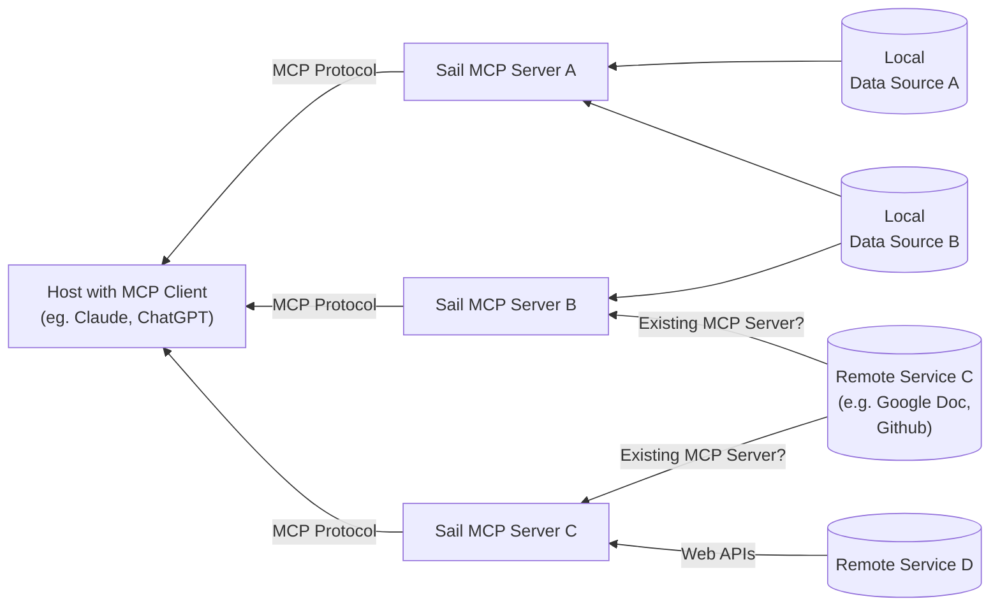

# Architecture Idea

This idea is dated June 30, 2025. 

## Bundling
One benefit we give the user is the ability to combine knowledge from different sources into a single MCP server. For instance, if I want to keep an investor updated, I would make an Sail MCP server for him (accessible through a single URL i provide), which is connected to my github, the transcripts of my internal calls on google docs, and some local notes i've saved as markdown files on my local machine (laptop). 

## Navigating stores with existing MCP servers
Some knowledge sources, such as GitHub, already provide access via remote MCP servers. In a case such as that, I'm not sure how to access them -- do we have to use their tool functions, or can I build my own tools (eg can i add value with my own tooling)

## Illustrative Diagram

