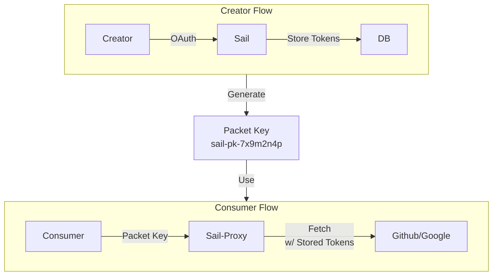
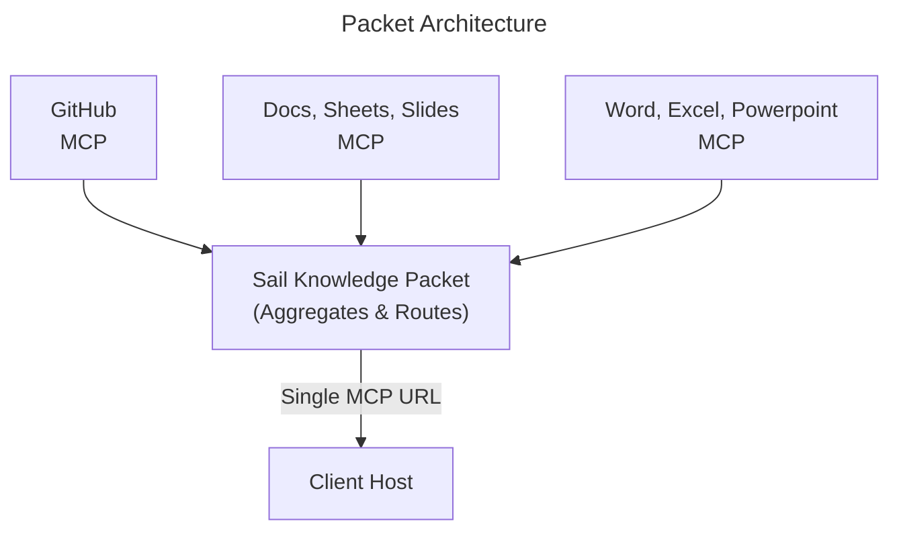

# Vision

## Bundling
One benefit we give the user is the ability to combine knowledge from different sources into a single MCP server. For instance, if I want to keep an investor updated, I would make an Sail MCP server for him (accessible through a single URL i provide), which is connected to my github, the transcripts of my internal calls on google docs, and some local notes i've saved as markdown files on my local machine (laptop). 

## Navigating stores with existing MCP servers
Some knowledge sources, such as GitHub, already provide access via remote MCP servers. In a case such as that, I'm not sure how to access them -- do we have to use their tool functions, or can I build my own tools (eg can i add value with my own tooling)

# Auth
i assume each existing MCP server has a credentials auth page. so we need to get that auth from the user, either once at the log in phase (preferred), or each time a new packet is made that requires access to a server. the user on the clinet side, who is reading the packet with an LLM, maybe go thru that google auth window for our app, to verify themselves. OR, we could issue a "packet key" and when the users on the client side want to access the packet, all the auth requires of them is the packet key, which the creator will give to them via text or email, or whatever, wen they distriobute their packet. the users who will come on board first will be the cfreators of packets. and in many cases the people accessing those packets will not be as tech savy, and probably do not have a sail mcp account. we want to get them excited about these packets, which will GET them to generate a sail mcp account. I like the idea of a packet key. It's kind of like the ID that openAI creates for the vector databases it hosts. 

## Packet Key Architecture

For Packet Creators (tech-savvy):
1. Sign up for Sail account
2. Connect their cloud services (one-time OAuth flow)
3. Create knowledge packets
4. Get a Packet Key like: sail-pk-7x9m2n4p
5. Share key with anyone via text/email

For Packet Consumers (non-technical):
1. Receive packet key from creator
2. Add to Claude: https://mcp.sailmcp.com/pk/sail-pk-7x9m2n4p
3. No login required! Just the key
4. Access all bundled knowledge sources
5. Get excited → Sign up for Sail to create their own

### Benefits

1. Zero friction for consumers - Just a key, no auth
2. Viral growth loop - Consumers become creators
3. Security - Keys can expire, be revoked, have permissions
4. Analytics - Track packet usage, popularity
5. Monetization - Premium keys, usage limits

## Illustrative Diagram

3